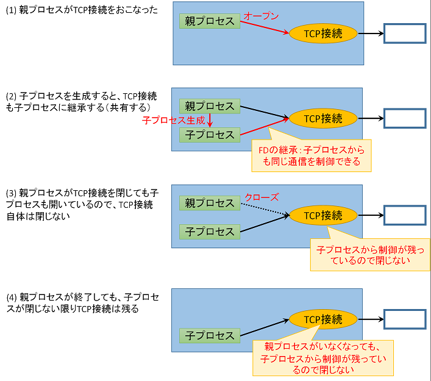

# TCPポートがbindできないことがある

## 動機
　TCPのサーバ側を用いているプログラムがある。プログラムを再起動したらそのポートをbindできないことがある。

## 回答
ポートのbindに失敗する場合はおおむね、以下が原因となっている：
- SO_REUSEADDRオプションを有効にしていない
- close-on-execフラグを付けていない（子プロセスが邪魔をする）
- すでに一時ポートとして使われてしまっていた

### SO_REUSEADDRオプションを有効にしていない
TCPでサーバ側を作る場合は常にSO_REUSEADDRオプションを有効にする。
具体的には、setsockoptでSO_REUSEADDRオプションを1に設定する。

bindするポート番号についてローカル側に存在する場合（TIME_WAITも含む）、このオプションが有効にしてしないとbindに失敗する。SO_REUSEADDRオプションを有効にしなかった場合の典型的な障害は：
1. TCPでサーバ側をオープン
2. クライアントから接続された
3. 例えば問題があってサーバ側のプログラムが終了する
4. サーバ側のプログラムを再起動するが、TCPのサーバがbindに失敗

である。
2でつながったTCP接続を、3でサーバ側からクローズしたためTIME_WAIT状態として残ったからである。

### SO_REUSEADDRオプションを有効にしているのに失敗する
上記状況であっても、別の（例えばTIME_WAITの）ソケットがSO_REUSEADDRオプションが付与されていなかった場合はbind()に失敗する。例えば、そのポート番号がエフェメラルポート番号の範囲で別のプログラムによって使われてしまった場合がある。
[受信ポートをエフェメラルポートの範囲内にしない](ephemeral_port.md)を参照。

実際のところ、SO_REUSEADDRオプションと挙動の詳細については単純に述べることができず私も把握していないのが実情だが（それに、多分、規格のようなもので決まっているわけでない）、目下、TCPでサーバ側は常にSO_REUSEADDRオプションを有効にすると認識しておけばよい。

### close-on-execフラグを付けていない（子プロセスが邪魔をする）
　ソケットを作る際にclose-on-execフラグを付与する。具体的には、socketではSOCK_CLOEXECを指定、acceptは使わずaccept4を用いてSOCK_CLOEXECを指定する。

　Unix/Linuxにおいて、子プロセスを生成した際にいくつかの情報はそのまま継承される。この情報には、ソケットをはじめとしたFD(ファイルディスクリプタ)もそれに含まれる。ここで、親プロセスが開いたソケットについて子プロセスが継承した場合、親プロセスだけでなく子プロセスでもそのFDを閉じないと完全に閉じない。
　ここで子プロセスが残ったままの場合、新しい親プロセスを起動しても古い子プロセスが通信を終了していないためbindに失敗する。

この状況に対応するには：
1. 子プロセスにファイルディスクリプタが継承されないように、都度設定する
2. 子プロセスの生成時、子プロセス側で余計なファイルディスクリプタを閉じる

しかない。

　ここで、我々のプログラムのほとんどはマルチスレッドであること、および子プロセスの生成にライブラリ関数を使わずfork・execl・waitの組み合わせを自力で実装する必要があることら、2を確実に制御するのは非常に難しい。
　よって、1をおこなうしかない。これを実現するのがclose-on-execという機構である。このオプションを付与すると、子プロセスにファイルディスクリプタが継承されないようになるため、上記事象を考慮する必要がなくなる。

### すでに一時ポートとして使われてしまっていた
　bindするポート番号は、一時ポートとして使われるポート番号を避けるか、OSが使わないように設定を変更する。≪受信ポートをエフェメラルポートの範囲内にしない≫を参照。
